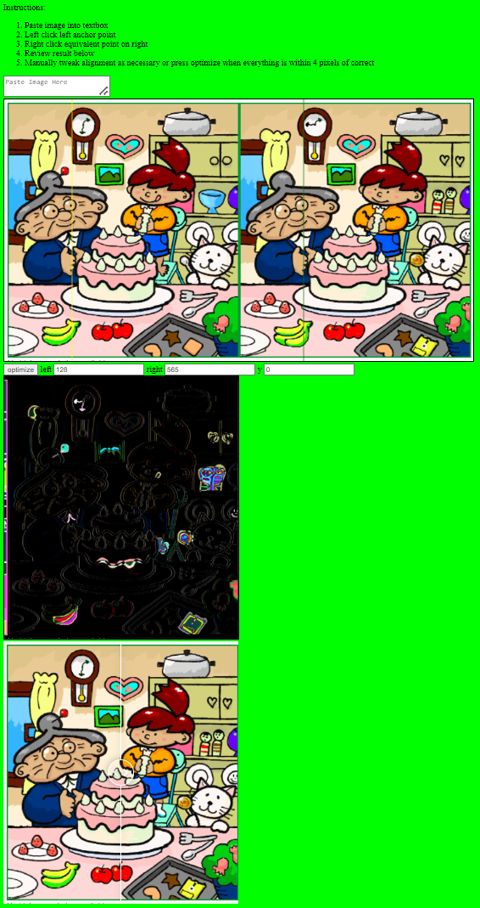

# imageCompare
imageCompare is a webpage that allows you to compare two sides of an image pasted from the clipboard.

https://asteriskman7.github.io/imageCompare

After pasting the image from the clipboard into the textbox, left click the reference image to set the left image reference line and right click the reference image to set the right image reference line. The two lines should be on the same spot on the two images.

To make single pixel adjustments as well as updating the vertical alignment, you can use the left/right/y text boxes or press the optimize button which will attempt to find the best alignment within 4 pixels of the current alignment.

After alignment, the 2nd image will show differences while common features will be black. Moving the mouse cursor on either the reference images or the comparison image will also show a cursor on the other image in the equivalent location(s).

The third image allows sliding between the left and right images which may make some differences easier to see.

## Example use

(The [image](https://commons.wikimedia.org/wiki/File:Spot_the_difference.png) used in this example is from Muband at Japanese Wikipedia and subject to [Creative Commons Attribution-Share Alike 3.0 Unported license](https://creativecommons.org/licenses/by-sa/3.0/deed.en))
